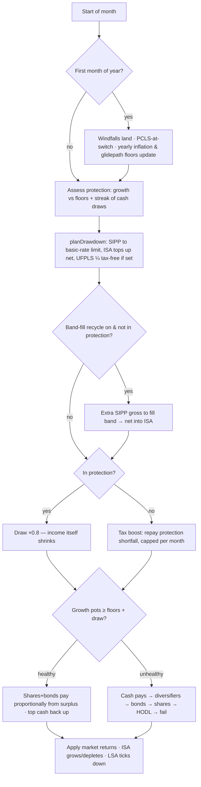

# Pots & Valves — the current strategy, as coded

_Phase A distillation per `pensiontools-strategy-engine-brief.md` (v4). Sources of truth:
`src/services/SimulationEngine.js` (stress), `src/services/legacyDecision.js` (monthly tool),
shared modules `DrawdownStrategy / ProtectionStrategy / TaxBoostStrategy / GlidepathService /
SpendingModel / SubAssetReturns`. Deviation from the brief: this file lives in
`design/strategies/` because `docs/` is this repo's build output._

## Plain spec (≤300 words)

Your money sits in pots: **shares**, **bonds**, **cash**, optionally a **diversifiers** sleeve
(gold + trend, held flat as a crisis reserve) and a **HODL** emergency reserve behind glass. A
separate **ISA** pot is the tax-free bridge. Each pot except cash has a **floor** that starts at
your chosen allocation and — by design — melts linearly to zero over the plan (floors inflate
with CPI but deplete with time); cash's floor holds its real value. An optional **bond tent**
re-splits the shares/bonds floor over the years.

Each month the plan computes the income you need — your budget's per-year schedule (or flat
target) × inflation × the spending profile — then works out the tax-smart draw: SIPP up to the
basic-rate limit, ISA topping up the rest tax-free, UFPLS quarter tax-free if chosen, an
optional band-fill surplus recycled into the ISA.

The **valves** decide which pot pays. Healthy months (growth pots above floors + this draw):
shares and bonds pay proportionally from their surpluses, and a little extra tops the cash pot
back up. Unhealthy months or **protection mode**: cash pays instead — and protection *also
shrinks the draw itself* (default ×0.8). Protection trips after 3 consecutive cash-side draws
while growth sits below floors, and releases once growth clears floors plus a £15k buffer;
missed income is later repaid by a **tax boost** (capped per month, kept inside the basic band)
once markets recover. If cash empties, the spill order is diversifiers → bonds → shares → HODL.
Failure is every pot empty.

**Taper option (as coded):** spending is level for years 0–4, drifts down 1%/yr real for years
5–24, then holds — about an 18% total real decline; `flat` is the default.

## Parameter inventory

| Group | Parameters (engine names) |
|---|---|
| Income | `baseSalary` (gross anchor), `targetSchedule[]` (per-year, from budget), `spendingProfile` flat\|declining |
| Pots & floors | `equityStart/bondStart/cashStart`, `equityMin/bondMin/cashTarget`, `diversifierStart`, `hodlEnabled/hodlValue`, `duration` |
| Tent | `equityGlideEnabled`, glide resolved by `tentGlideForSettings` (start-anchored for tagged plans) |
| Valves / protection | `consecutiveLimit` (3), `protectionMult` (0.8) / decision `protectionFactor` (20%), `recoveryBuffer` (15000), `disableProtection` |
| Tax draw | `pa/brl/hrl`, `taxMode` inflates\|frozen, `isaBalance`, `isaDrawdownStrategy`, `accessMethod` drawdown\|ufpls, `ufplsYears`, `ufplsThenPcls`, `bandFillRecycle` |
| Guaranteed income | SP (`spStartDate/spWeeklyAmount` or legacy year), `dbAmount/dbStartYear/dbIndexation`, `other`, `extraIncomes[]`, `windfalls[]` |
| Returns model | historical/block-bootstrap equity+inflation; bonds/diversifiers via sub-asset registry when `subAsset` present; cash = max(0, prevInf − 1%) |

## One simulated month (Mermaid)

## Storyboard (the four fixed captions) — and where the code disagrees

1. "Your money sits in pots, each with a floor." ✅ (but see contradiction 1)
2. "Each month, the pot that can best afford it pays you." ✅ broadly
3. "In bad markets, the safe pots take over." ⚠️ true, **and** income is cut (contradiction 2)
4. "In good markets, the pots refill and floors are restored." ❌ (contradictions 1 & 3)

## Coded behaviour that contradicts the user's mental model

1. **Floors are not floors — they are ramps to zero.** Every floor except cash depletes
   linearly to £0 over the plan by design. Nothing "restores" a floor; caption 4 is wrong as
   worded for this engine.
2. **Protection cuts your income, not just the source.** In protection the draw is multiplied
   by 0.8 — spending falls 20% in bad markets. Users reading "the safe pots take over" expect
   constant income from a different pot. (The tax boost later repays the shortfall, but only
   within the same tax year's remaining months and only under the basic-rate limit.)
3. **Only cash refills, and only in the stress tester.** "Pots refill" is one-way: growth
   surplus tops up cash (30%/50% capped, £5k gate). Shares/bonds never refill from anywhere.
   In the monthly Decision tool the refill is *advice text*; in the stress tester it is
   *auto-executed* — the two tools genuinely differ here.
4. **All-or-nothing valves.** A month is either fully growth-funded or fully cash-side; there
   is no mixed draw (the dead `ProtectionService` had one; the live engines do not).
5. **Sourcing order differs between the tools.** Stress spills cash → diversifiers → bonds →
   shares → HODL; the Decision tool only advises cash → diversifiers, and rebalancing advice
   exists only on the Decision side.
6. **The stress tester's tax year is the plan year, not 6 April.** Decision uses real UK tax
   years; stress aligns tax years to simulation years. Cross-validated as equivalent for
   parity, but a user inspecting month-by-month output would notice.
7. **The ISA is a separate engine.** It grows at its own rate (or tagged mix), pays the net
   gap tax-free, and never participates in floors, protection, or valves.

## Resolutions implemented (research-backed, Aug 2026)

Contradictions 2–5 were resolved by implementing the published industry standard (sources:
Guyton-Klinger FPA 2006; Kitces on buckets-vs-rebalancing & risk-based guardrails; Benz/
Morningstar bucket maintenance; Estrada IESE; Vanguard dynamic spending; Income Lab):

- **(2) Staged income cuts** — a single 20% cut is double the G-K norm. `protectionMultForStreak`
  now applies HALF the configured cut for the first 12 months of a protection episode, the full
  cut only under persistent stress. "Repayment" framing renamed to restoration/catch-up (the
  Tax Boost already worked this way).
- **(3) One rules engine** — `WithdrawalSourcing.planSourcing` is shared: the stress tester
  EXECUTES it, the Decision tool RECOMMENDS the identical numbers (incl. the cash-refill figure,
  previously advice-only with different thresholds). Cash-only refill KEPT — Evensky/Benz
  standard; growth pots are never auto-refilled.
- **(4) Mixed/partial draws** — the G-K funding cascade replaces all-or-nothing valves: growth
  surplus part-funds, the remainder cascades. This also fixed the pinned "stranded bucket" bug.
- **(5) One spill order, overweight-ranked** — cash first, then the sleeve most overweight vs
  its target (diversifiers vs flat start, bonds/equity vs floors), HODL strictly last — G-K's
  Portfolio Management Rule ("sell what held its value") rather than a hardcoded order. Both
  engines now also count the SAME cash-streak (any non-Growth month) for protection triggers.

Contradiction (1) — floors that deplete by design — is a DESIGN choice, kept and to be fixed in
COPY: the Phase E storyboard caption must say "the cash pot refills" rather than "floors are
restored". (6) and (7) are documented in the assumption register below.

_Phase A review complete; standards research applied. Strategy-interface work (Phase B) not yet started._

## Assumption register (resolutions for contradictions 6 & 7 — documented, not changed)

| # | Assumption | Status & rationale |
|---|---|---|
| 6 | Stress-tester tax years align to plan years, not 6 April | KEPT. Cross-validation pins decision-vs-stress parity on identical trajectories; aligning to 6 April would complicate the sim for no accuracy gain at annual granularity. Revisit in the PlanContext refactor. |
| 7 | The ISA sits outside floors/protection/valves | KEPT — deliberate design. The ISA is the tax-free bridge: a stable pot drawn by the tax planner (`planDrawdown`), not a market pot the valves manage. It is included in wealth reporting and can be modelled at the tagged asset mix (`isaMix`). |
